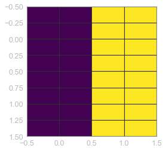
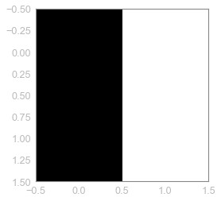
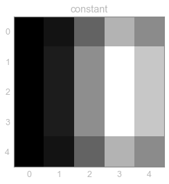
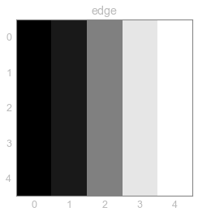
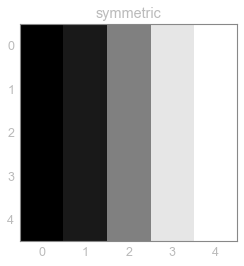
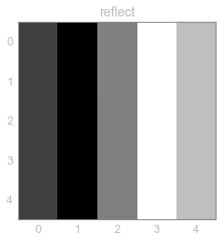
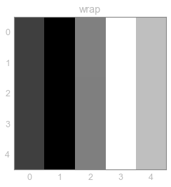

```python
# import required packages
import numpy as np
import matplotlib.pyplot as plt
from skimage.transform import resize
%matplotlib inline
```


```python
# originl image
image = np.array([[0., 1.], [0., 1.]])
print('image:\n', image)
plt.imshow(image)
```

    image:
     [[ 0.  1.]
     [ 0.  1.]]
    


    <matplotlib.image.AxesImage at 0x264f9bffd30>





```python
# different modes for image resizing
modes = ['constant', 'edge', 'symmetric', 'reflect', 'wrap']
```


```python
# applying each mode on the original image and storing all output images into a dictionary, key as mode and value as output image
RImg = {}
for m in modes:
    img_resized = resize(image=image, output_shape=(5, 5), mode=m)
    RImg[m] = img_resized
```


```python
# Resultant resized images
RImg
```


    {'constant': array([[ 0.  ,  0.07,  0.35,  0.63,  0.49],
            [ 0.  ,  0.1 ,  0.5 ,  0.9 ,  0.7 ],
            [ 0.  ,  0.1 ,  0.5 ,  0.9 ,  0.7 ],
            [ 0.  ,  0.1 ,  0.5 ,  0.9 ,  0.7 ],
            [ 0.  ,  0.07,  0.35,  0.63,  0.49]]),
     'edge': array([[ 0. ,  0.1,  0.5,  0.9,  1. ],
            [ 0. ,  0.1,  0.5,  0.9,  1. ],
            [ 0. ,  0.1,  0.5,  0.9,  1. ],
            [ 0. ,  0.1,  0.5,  0.9,  1. ],
            [ 0. ,  0.1,  0.5,  0.9,  1. ]]),
     'reflect': array([[ 0.3,  0.1,  0.5,  0.9,  0.7],
            [ 0.3,  0.1,  0.5,  0.9,  0.7],
            [ 0.3,  0.1,  0.5,  0.9,  0.7],
            [ 0.3,  0.1,  0.5,  0.9,  0.7],
            [ 0.3,  0.1,  0.5,  0.9,  0.7]]),
     'symmetric': array([[ 0. ,  0.1,  0.5,  0.9,  1. ],
            [ 0. ,  0.1,  0.5,  0.9,  1. ],
            [ 0. ,  0.1,  0.5,  0.9,  1. ],
            [ 0. ,  0.1,  0.5,  0.9,  1. ],
            [ 0. ,  0.1,  0.5,  0.9,  1. ]]),
     'wrap': array([[ 0.3,  0.1,  0.5,  0.9,  0.7],
            [ 0.3,  0.1,  0.5,  0.9,  0.7],
            [ 0.3,  0.1,  0.5,  0.9,  0.7],
            [ 0.3,  0.1,  0.5,  0.9,  0.7],
            [ 0.3,  0.1,  0.5,  0.9,  0.7]])}


```python
# visualizing the original image
plt.imshow(image, cmap='gray')
plt.grid('off')
```





```python
# visualizing the output images
for k,v in RImg.items():
    plt.imshow(v, cmap='gray')
    plt.title(k)
    plt.grid('off')
    plt.show()
```
















